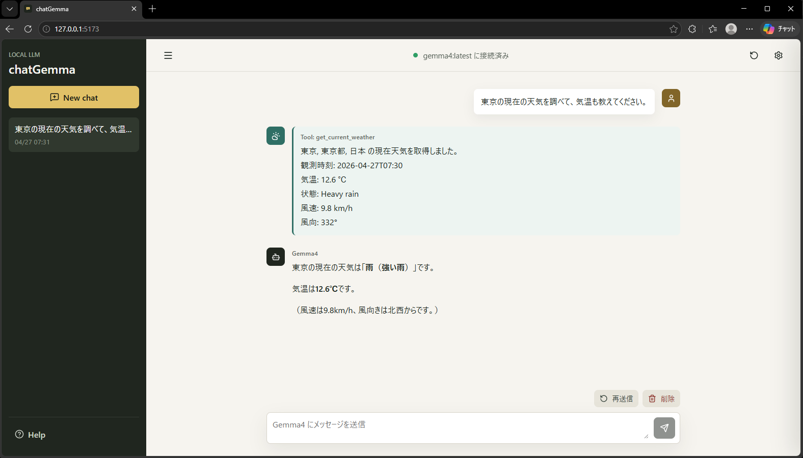

# chatGemma

Ollama 上の `gemma4:latest` とブラウザで会話するためのローカルチャットアプリです。ChatGPT 風の会話 UI、会話履歴のブラウザ保存、Markdown 表示、Tool Calling の検証用天気取得機能、ピクセルマスコット演出を備えています。



## Features

- Ollama `gemma4:latest` とのローカルチャット
- ストリーミング応答表示
- 会話履歴の `localStorage` 保存
- 新規チャット、会話切り替え、再送信、削除
- Markdown 表示対応
- 通常チャットモードとエージェントモードの切り替え
- model / temperature / system prompt の設定
- エージェントモードで使える Function Calling / Tool Calling の検証用 `get_current_weather`
- エージェントモードで使える現在日時取得と単位変換ツール
- Open-Meteo を使った現在天気の取得
- 日本語ヘルプページと Model controls の説明
- 画面スクロールに引っ張られない固定レイアウト
- ピクセルマスコットの空状態表示、assistant avatar、待機アニメーション
- レスポンシブ UI

## Requirements

- Node.js
- npm
- Ollama
- Ollama に `gemma4:latest` がインストールされていること

```powershell
ollama list
```

`gemma4:latest` がない場合は、利用するモデル名に合わせて `OLLAMA_MODEL` を設定するか、Ollama 側にモデルを用意してください。

## Setup

```powershell
npm install
npm run build
npm start
```

起動後、ブラウザで以下を開きます。

```text
http://127.0.0.1:3001
```

API の状態確認:

```text
http://127.0.0.1:3001/api/health
```

## Development

開発時はフロントエンドと API サーバーを同時に起動できます。

```powershell
npm run dev
```

フロントエンド:

```text
http://127.0.0.1:5173
```

API サーバー:

```text
http://127.0.0.1:3001
```

## Chat Mode / Agent Mode

通常チャットモードでは、Gemma4 に会話履歴だけを渡して回答を生成します。Ollama には tools を渡さないため、Tool Calling は行われません。

エージェントモードでは、Gemma4 が必要に応じて `get_current_datetime`、`convert_units`、`get_current_weather` を呼び出せる構成になっています。サーバー側でツールを実行し、その結果を tool message としてモデルに戻して最終回答を生成します。

例:

```text
東京の現在の天気を調べて、気温も教えてください。
```

エージェントモードでの Tool Calling の流れ:

1. ユーザーが天気を質問
2. Ollama が必要な tool call を返す
3. Express サーバーが対応するツールを実行する
4. tool result を Gemma4 に戻す
5. Gemma4 がユーザー向けの回答を生成

## UI Notes

- トップバー、サイドバー、入力欄は画面内に固定され、会話本文とヘルプ本文だけがスクロールします。
- サイドバーはリストボタンで開閉します。会話やヘルプを選択しても自動では閉じません。
- 空状態では高解像度の透過マスコットを表示します。
- assistant avatar と待機マスコットには `public/mascot/` 配下の sprite sheet を使用します。
- 一定時間操作がない場合、入力欄右上に小さな待機マスコットが表示されます。

## Scripts

```text
npm run dev          # client/server を開発起動
npm run dev:client   # Vite dev server
npm run dev:server   # Express API server
npm run build        # TypeScript と Vite build
npm start            # dist から本番相当起動
npm run preview      # Vite preview
```

## Environment Variables

| Name | Default | Description |
| --- | --- | --- |
| `PORT` | `3001` | Express サーバーのポート |
| `OLLAMA_BASE_URL` | `http://127.0.0.1:11434` | Ollama API の URL |
| `OLLAMA_MODEL` | `gemma4:latest` | 使用する Ollama モデル |

## Notes

- 会話履歴と設定はブラウザの `localStorage` に保存されます。
- サーバー側 DB、認証、複数ユーザー対応は未実装です。
- Tool Calling は現在、現在日時、単位変換、天気取得ツールを実装しています。
- 今後の追加案メモは `FUTURE_IDEAS.md` にありますが、ローカル検討用として `.gitignore` に含めています。

## License

MIT
